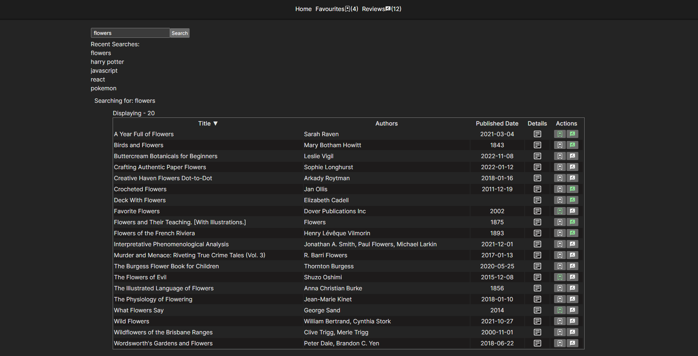

# Google-Books


## Preview


### Desktop
#### Home Page

#### Review Page

#### Mobile Reviews


## Deployed Version


* [Link](https://google-books-edric.vercel.app/)


## Setup


* To install dependencies open terminal cd into the root folder
 ```
 npm install
 ```
 * Run Application
 ```
 npm run dev
 ```
  * Run Tests
 ```
 npm run test
 ```


## Description of project (spec / MVP)


### MVP:
Create a page that allows users to search for books Page should include the following:
  - Fetch and display a list of books related to flowers from the following REST API: https://www.googleapis.com/books/v1/volumes?q=flowers -- [x]
  - Present the fetched data in a table, including book title, authors, and published date. -- [x]
  - Enable users to view more details of a selected book, such as title, subtitle, authors, image, and description. -- [x]


### Bonus (optional):
* Sorting books by title, author, publish date -- [x]
* Book search -- [x]
* Add search history -- [x]
* favouriting books (could be done with redux) -- [x]
* books rating system (could be done with redux) -- [x]
* adding personal reviews to your books (could be done with redux) -- [x]
* using google books API collections features
* Getting good reads links and displaying them on the page
* Book form for submission for books you can't find in the API (react-hook-form)
  
## Approach
* Decided to use React with Typescript for the project instead of vanilla Javascript to challenge myself and learn about type safety.
* Looked at similar web applications like IMDb online to see functionality and how error were handled.
* Played with the API hitting the endpoint to see what the structure of the json object being displayed.
* Understanding the database first was important as then I could map through the data and display it on the page.
* SCSS was used for styling to create modular styling for each component.
* Redux was used as global state management for favourites and reviews, this made passing data to various components that needed it easier.


## Reflection
* What went well?
  - First time using redux, once the boiler-plate code was set up it was easy to implement into the app.
* What are you proud of? 
  - I am proud that the functionality of search and next page on favourites and reviews work nicely together.
* What was a challenge?
  - Testing react components that used useQuery from reactQuery or redux as additional steps were required to mock out the data which I was unfamiliar with.
  
* What you'd do differently?
  - I would do the sorting on the home page from the api rather than just on state data.


## Future Goals


* Style the page better, with a color palette.
* Redo sorting for home page


## Further reading or links to inspiration


*  [Google Books API no Auth link]( https://developers.google.com/books/docs/v1/using#WorkingVolumes)
*  [Using Async Await]( https://dmitripavlutin.com/javascript-fetch-async-await/)
*  [Using Postman to Test APIs]( https://www.blazemeter.com/blog/how-use-postman-test-apis)


## Stay in touch


*  [Portfolio]( https://edric-khoo.vercel.app/)
*  [Linkedin]( https://www.linkedin.com/in/edric-khoo-98881b173/)


